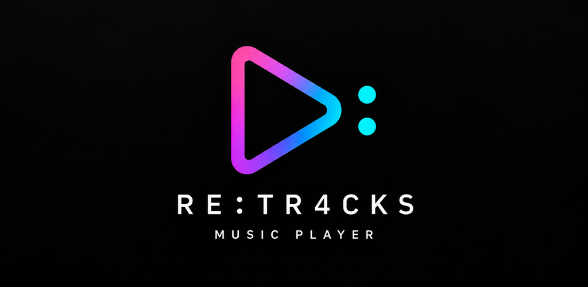

# RE:TR4CKS



Offline music player for rediscovering your local music.

> Remember. Replay. Rediscover. Revisit.

[日本語版はこちら](README_JA.md)

## Get the app

<p>
  <a href="https://apps.apple.com/us/app/re-tr4cks-music-player/id6811712770"></a>
  &nbsp;
  <a href="https://play.google.com/store/apps/details?id=com.yskms.retracks"></a>
</p>

## What is this

A music player for local files already on your Android or iOS device.
It exists to solve one problem: you own thousands of tracks but keep hearing the same few.

Two ideas carry the app.

### RUSH

A mode that plays only a slice of each track, then moves on — so you keep running into
songs you had forgotten about. You choose the start offset, the length, and the fades.
Turn it off and the app behaves like an ordinary music player.

### A shuffle that actually completes a cycle

The shuffle order and your position in it are persisted.

In a typical player, shuffling reshuffles every time you reopen the app. Even with a
thousand tracks, a single listening session covers a few dozen — so you only ever hear
"the first few dozen of a fresh permutation," and most of your library is never reached.

This app stores the permutation and the cursor, and will not repeat a track until the
cycle is finished. Newly added tracks are inserted at random into the part you have not
reached yet, so they surface without waiting for a full cycle.

## Status

**Android 1.1.0 is released. The iOS release is also available and actively maintained.**

Design decisions and the reasoning behind them live in the
[requirements document](docs/requirements.md) (Japanese).
For a concise project timeline and current priorities, see the
[development history](docs/development-history.md) (Japanese).
See the [privacy policy](docs/privacy-policy.md) for privacy details.

## Technical notes

- **Expo SDK 57 / React Native 0.86** (New Architecture)
- **The playback layer is a custom Expo module** (Kotlin + Media3). No existing library
  could satisfy "skip to next track from the notification and from headset controls" —
  `expo-audio` explicitly removes those MediaSession commands, `react-native-track-player`
  v4 predates the bridge removal in RN 0.85, and v5 is commercially licensed
- Segments are cut by `MediaItem.ClippingConfiguration`, letting ExoPlayer itself end each
  item sample-accurately rather than polling the playback position
- Fades compensate for the audio write-ahead: `player.volume` applies to samples about to
  be written, not to what is currently audible, so the gain is computed from a
  look-ahead position
- Android and iOS. Playback is limited to local music on the device

## Development

The app contains native code, so **it does not run in Expo Go**. A local build is required.

```bash
npm install

# Requires the Android SDK (set ANDROID_HOME)
npx expo run:android
```

### Layout

| | |
|---|---|
| `modules/retracks-player/` | Playback layer. ExoPlayer + MediaSessionService |
| `src/rush.ts` | Segment resolution (boundary handling and fade clamping) |
| `src/shuffle.ts` | Shuffle permutation and cycle persistence |
| `src/library.ts` | Library scanning and caching |
| `docs/requirements.md` | Requirements document (Japanese) |
| `docs/development-history.md` | Milestones and release history (Japanese) |
| `docs/README.md` | Public documentation index (Japanese) |

## Naming

| Purpose | Name |
|---|---|
| Brand | RE:TR4CKS |
| Store name (candidate) | RE:TR4CKS Music Player |
| Experience concept | RUSH |
| Repository / internal identifier | retracks |

## License

Copyright (c) 2026 yskms. All rights reserved.

The source is published for reading. No license to use it is granted —
copying, modifying, redistributing, or republishing is not permitted.
